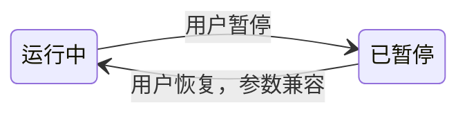
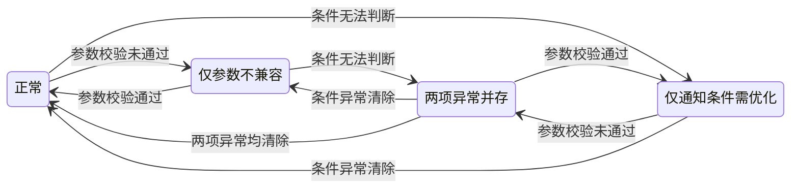
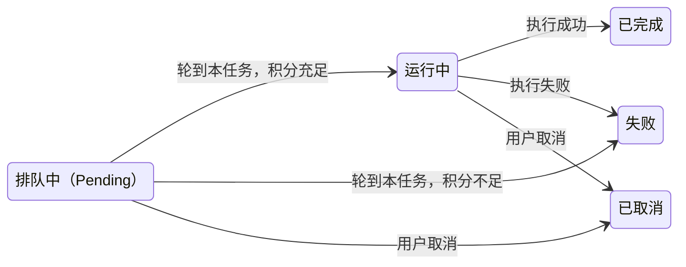

# Bot 定时任务

版本：v1.59.0。Agent Bot 与工作流共用人工配置的定时任务。

## 1.1 核心目的

以商品价格监控为例：用户希望每天获取一次商品价格，在结果值得关注时收到邮件，并能继续调整后续安排。

主路径只有三个节点：选择已发布 Bot → 人工配置定时器 → 持续运行与交付。根据结果调整设置，是从第三步回到第二步的闭环。

定时器只负责按计划触发任务创建；平台接受后，任务按自身规则排队、开始、完成或失败；平台负责结果比较与邮件交付。触发时段约束任务创建时间，任务创建后的执行过程由任务自身决定。两类 Bot 共用这组对象与规则，差异集中在执行方式和指定条件判断。

| 能力 | Agent Bot | 工作流 |
| --- | --- | --- |
| 创建与管理 | 用户手动创建、编辑、暂停、恢复、删除 | 同左 |
| 执行内容 | 当前已发布 Bot，包含已有运行兜底 | 当前已发布的工作流节点 |
| 通用结果通知 | 结果变化、每次成功、不发送 | 同左 |
| 指定条件通知 | Run Agent 分析本次成功结果，随结果提交结论与通知内容 | 使用通用通知策略 |
| 排队、重试、发布冲突修复 | 共用规则 | 同左 |

## 2.1 创建定时器

从已发布 Bot 的卡片数量、更多菜单的定时器选项，或 Bot 内定时器页签进入所属列表。两类 Bot 共用这条人工创建路径。

新建弹窗按触发计划、执行设置、结果通知三步展开，左侧显示进度。默认值已填写；用户仅修改需要调整的部分。最后一步直接创建。

创建成功关闭弹窗，返回所属列表并定位新记录，卡片数量增加一条，从下一个计划时点触发。未发布的 Bot 先完成发布。

字段默认值与校验见 §3.2.3，保存与取消规则见 §3.2.4。

## 2.2 编辑定时器

点击列表名称打开右侧抽屉。点击参数不兼容定位执行设置；点击通知条件异常定位结果通知。

触发计划包含名称、触发频率、日期或星期、时间或时段、时区；执行设置包含输入参数、自动重试与最终失败提醒；结果通知包含策略及 Agent Bot 的指定条件。

编辑回显已保存值。切换分类保留未保存内容，底部统一保存。成功后返回所属列表并定位原记录，数量与启用状态保持原值。新设置用于下一次计划触发；已有任务和已登记重试保留原快照。

创建与编辑使用相同字段及校验，见 §3.2.3–§3.2.4。

## 2.3 查看结果并继续调整

在定时器列表点击“查看任务”，进入所属 Bot 的局部任务列表，自动按定时器 ID 筛出相关任务。查看过程、结果及重试关联后，点击任务上的定时器名称，回到所属 Bot 的定时器列表并定位原记录；再点击列表名称进入编辑。

因余额不足或排队已满而未能发起的任务，每次立即新增一条站内信“异常”消息。用户查看本次失败时间、原因和对应资源，点击定时器名称回到对应列表处理，见 §3.5。

工作流、Agent Bot 的局部任务列表与全局任务列表，都展示相同的定时器来源与搜索入口。定时器 ID 保持关联，名称用于识别和搜索。

定时器已删除时提示“定时器已删除”，已有任务及历史仍保留触发时的名称。后续改名不会改写历史名称或已发送邮件。

## 3.1 Bot 列表

### 3.1.1 定时器数量与管理入口

卡片数量统计所属 Bot 已创建的全部定时器，包含暂停和配置异常的计划。

| 实际数量 | 卡片右上角显示 | 点击结果 |
| --- | --- | --- |
| 0 | 隐藏日历图标与数量 | 更多菜单保留定时器入口，可进入空列表新建 |
| 1–99 | 日历图标 + 实际数量 | 进入所属 Bot 的全部定时器列表 |
| 大于 99 | 日历图标 + 99+ | 同样进入完整列表，全部定时器均可查看 |

悬停提示与无障碍名称保留实际数量。新建或删除成功后同步更新数量；暂停、恢复或配置状态变化保持总数。列表搜索与筛选仅改变列表结果，卡片数量始终统计该 Bot 的全部定时器。

保留两类 Bot 各自已有菜单内容及相对顺序。Agent Bot 在运行后增加定时器入口，工作流在删除前增加定时器入口。每个入口保留明确的 Bot 归属。

## 3.2 定时器管理

### 3.2.1 列表与搜索

列表提供全部定时器与参数冲突筛选，冲突筛选包含暂停的计划。全部修复后显示无冲突空态。

列表显示定时器名称及 ID，支持复制 ID。搜索框支持定时器 ID 或名称：ID 精确匹配，名称按关键词匹配，去除搜索词首尾空格；回车或点击搜索后生效，清空后恢复当前列表。搜索与参数冲突筛选共同生效，查询范围始终是当前 Bot。

每条定时器提供“查看任务”操作，无论启用或配置状态如何都可查看已有任务。点击进入所属 Bot 的局部任务列表，自动带入定时器 ID，显示该定时器创建的所有任务，包含排队、执行、终态与重试。尚未产生任务时显示空态，并保留筛选条件。

从任务来源名称进入时，定时器列表切换到所属 Bot，清除原先无关的搜索和冲突筛选，按 ID 筛出并定位这条记录。页面保留列表上下文，点击记录名称后才打开编辑抽屉；清空搜索可查看该 Bot 的全部定时器。

列表将“启用状态”与“配置状态”分列展示。配置状态显示正常、参数不兼容或通知条件需优化；两类异常同时存在时分别展示并提供对应修复入口。参数冲突筛选只按参数不兼容判断。

上次触发取最近一次成功创建任务的计划触发时间，包含随后进入 Pending 的任务；创建请求被拒绝时保留原值。按访问 IP 时区显示，识别失败用 UTC。重试保留原计划触发时间，并另有自己的创建时间。尚未成功发起任务显示空值，旧任务晚完成不覆盖较新的触发时间。

### 3.2.2 对象与关联

一个 Bot 可有多条定时器，一条定时器可创建多条运行任务。历史列表展示运行任务的记录，重试也有自己的记录。

| 对象 | 保存什么 | 生效边界 |
| --- | --- | --- |
| Bot | 构建类型、当前已发布执行内容与输入定义 | 发布影响之后按计划创建的任务 |
| 定时器 | 唯一 ID、所属 Bot ID、名称、计划、输入值及保存时的输入规范版本、通知与重试设置、启用状态，以及配置检查结果 | ID 创建后固定；名称在同一账户／工作空间内跨所有 Bot 唯一；设置用于下一次计划触发 |
| 运行任务 | 本任务 ID、所属 Bot ID、来源定时器 ID、触发时名称与配置、时间、状态、结果、原任务与重试关联 | 定时任务和重试均保留同一个来源定时器 ID；创建时固定执行快照 |

每次触发创建任务时，保存定时器身份与名称、计划触发时间、实际执行版本、输入参数、通知策略与条件、重试和失败提醒设置。排队期间发布或修改设置，已有任务继续使用自己的快照。

列表间跳转使用所属 Bot ID 与定时器 ID 定位。改名保持 ID 与历史关联；删除后任务继续保留原 ID 和触发时名称。手动、API 等非定时触发任务沿用各自来源。

### 3.2.3 配置字段与默认值

创建使用默认值；编辑回显保存值。两类 Bot 共用以下配置规则。

| 分类 | 字段 | 默认值与校验 |
| --- | --- | --- |
| 触发计划 | 名称 | 默认生成 scheduler-MMDD-序号，MMDD 为生成日期的月日，序号沿用现有 Bot 自动命名的编号规则；可修改，去除首尾空格后必填，最多 1024 字符；同一账户／工作空间内跨所有 Bot 唯一 |
| 触发计划 | 触发频率 | 一行“每隔 N 小时／天／周触发一次”；默认每隔 1 天，N 为正整数；下方字段随单位与间隔联动，见下表 |
| 触发计划 | 日期与时间 | 触发日默认周一至周日全选，至少保留一天；起始日期默认计划时区的今天，可选择今天至未来第 6 天，共 7 个日期；触发时间默认 09:00；小时模式默认全天，指定时段默认 09:00–18:00 |
| 触发计划 | 时区 | 首次创建取访问 IP 时区，识别失败使用 UTC；可修改，保存后固定；摘要按此时区展示下次触发时间 |
| 执行设置 | 输入参数 | 读取所属 Bot 当前已发布输入定义及默认值，保留 0、false；缺少默认值的必填项展开并显示待填数量 |
| 执行设置 | 自动重试 | 默认开启；首次失败后 1 分钟新建任务，每次计划触发最多重试一次 |
| 执行设置 | 最终失败提醒 | 默认开启，独立于成功结果通知策略 |
| 结果通知 | 策略 | 默认结果变化；两类 Bot 共用每次成功、不发送，Agent Bot 额外支持满足指定条件时 |
| 结果通知 | 指定条件 | Agent Bot 选择指定条件时由用户填写；去除首尾空格后必填，最多 1000 字符 |

工作流按开始节点参数顺序和约束展示，Agent Bot 按已发布参数定义展示。两类参数表单保留对应字段类型、校验和请求结构。编辑时先按 §3.2.6 匹配已保存的输入值，仅展示当前已发布定义中的字段；需要补填的字段自动展开并定位。

#### 一套触发条件

用户配置的是一套触发条件：**间隔规则 + 起始日期或触发日 + 时间或时段 + 时区**。小时、天、周是这套条件的不同配置方式。创建与编辑使用同一套计算、校验和生效规则。

| 条件 | 用户配置什么 | 系统如何使用 |
| --- | --- | --- |
| 间隔规则 | 每隔 N 小时、天或周 | 确定候选触发点的间隔；起点由当前模式的日期或时段决定 |
| 日期或星期 | 触发日，或起始日期 | 小时及每隔 1 天使用选中的星期；多天、周模式以起始日期定位重复周期 |
| 时间或时段 | 一个触发时间，或小时模式的起止时间 | 天、周模式使用固定钟点；小时模式从时段起点计算，保留截止时间以内的候选点 |
| 时区 | 保存的计划时区 | 统一解释以上日期、星期与时间；“今天”也按此时区计算 |

系统先计算满足以上配置的触发时点，再等待该时点到达。到点时定时器已启用且参数兼容，才发起任务创建。所有适用条件共同生效；任务接受与排队容量见 §3.3.3。

“触发”表示发起创建任务；任务何时开始、何时结束由任务侧决定。下一候选时间按计划计算，与上一任务的排队时间、执行耗时、完成时间无关。

#### 不同单位怎样组合条件

| 选择 | 下方显示 | 计算方式 | 示例 |
| --- | --- | --- | --- |
| 每隔 N 小时 | 触发日、触发时段、时区 | 每个选中日期都从时段起点重新计算；全天从 00:00 开始 | 每隔 5 小时，09:00–18:00：每天 09:00、14:00 触发 |
| 每隔 1 天 | 触发日、触发时间、时区 | 每个选中的星期，在指定时间触发一次 | 选周一、三、五，09:00：每周这三天各触发一次 |
| 每隔 N 天，N 大于 1 | 起始日期、触发时间、时区 | 以起始日期为起点，按日历每隔 N 天触发 | 9 月 17 日起每隔 3 天，09:00：9 月 17、20、23 日依次触发 |
| 每隔 N 周 | 起始日期、触发时间、时区 | 以起始日期为起点，每隔 N 周在同一星期触发 | 9 月 20 日（周日）起每隔 2 周，09:00：9 月 20 日、10 月 4 日、10 月 18 日触发 |

#### 起始日期的选择与生效

| 情况 | 规则 |
| --- | --- |
| 显示条件 | 每隔 N 天且 N 大于 1，或每隔 N 周时显示；其他模式使用触发日 |
| 新建或重新选择 | 只提供计划时区的今天至未来第 6 天，共 7 个日期；显示具体日期和星期，今天另作标识。例如今天是 9 月 17 日，可选 9 月 17–23 日 |
| 选择今天，但钟点已经过去 | 保留今天作为周期起点，从下一个未来触发点开始。例如周四 10:00 创建“从今天起每隔 1 周，09:00”，首次触发为下周四 09:00 |
| 编辑已有定时器 | 回显并允许保留原起始日期，即使原日期已早于今天；只改名称、通知等字段时，原周期继续。主动改日期时，使用上述 7 天选项 |
| 修改时区或填写期间跨日 | 按最新计划时区更新 7 天选项；未保存的选择超出范围时提示重新选择，保留其他输入。已保存的原日期仍可保留 |
| 保存后的日期 | 日期是固定的周期起点，不随每天“最近 7 天”的可选范围滚动。后续按该日期计算下一触发点 |

#### 小时模式的时段边界

小时模式的起点是**本段第一个候选触发时间**，截止时间是**本段允许触发的上界**，两者都用于判断何时创建任务。

**计算顺序：** 从时段起点开始，每次加 N 小时；候选点在截止时间以内则保留，超过截止时间则结束本段，改从下一个选中日的时段起点计算。下一次触发取这些候选点中尚未过去的第一个。

**已确认：每段重新计时。** 每个选中日期从时段起点重新计算间隔，下一段与上一任务的开始、结束时间无关。全天每隔 5 小时为 00:00、05:00、10:00、15:00、20:00；下一天重新从 00:00 开始。

**跨午夜建议，原型已演示：归属开始日。** 结束时间早于开始时间时，显示“次日”。例如只选周一，22:00 至次日 06:00，每隔 2 小时触发：周一 22:00，周二 00:00、02:00、04:00、06:00。周二凌晨属于周一这段安排，即使周二未勾选也会触发；午夜不重置间隔。该归属规则参考 [Adaptive 跨夜时段](https://documentation.adaptive.live/v1.1.x/platform/access-management/schedules)。

| 边界 | 原型采用的规则 |
| --- | --- |
| 下一个候选点超过截止时间 | 跳过该点，取下一个选中日的时段起点。例如每隔 5 小时，09:00–18:00，候选点为 09:00、14:00、19:00；19:00 超出范围，下一次为下一选中日 09:00 |
| 到达时段结束时间 | 间隔恰好落在结束时刻时触发一次；否则以最后一个落在时段内的时点为准。例如每隔 5 小时，09:00–18:00，只有 09:00、14:00 |
| 创建或恢复时，本段候选点已过去 | 从下一个未来候选点开始。例如每天 09:00–18:00 每隔 5 小时，13:00 保存则下次为当天 14:00；15:00 保存则下次为次日 09:00 |
| 下一个自然日未选中 | 继续寻找下一个选中的星期。例如只选周一、周五，周五最后一个有效触发点之后，下一次是周一的时段起点 |
| 间隔超过时段长度 | 该段只在起点触发一次；下一选中日期仍从起点重新计算 |
| 起止时间相同 | 提示修改；全天通过“全天”选项设置 |
| 全天的午夜边界 | 当日从 00:00 起计算到午夜前；次日 00:00 归次日，避免重复触发 |

#### 配置生效与任务执行

| 边界 | 统一规则 |
| --- | --- |
| 单位或间隔切换 | 只显示当前模式需要的字段；本次编辑中切回原单位保留已填值，隐藏字段不参与校验、保存与时间计算 |
| 保存、修改或恢复 | 从下一个未来触发点开始；已过去的触发点不补发。修改仅在成功保存后生效 |
| 触发日与触发时段 | 决定何时创建新任务；已经创建的任务保留自己的执行快照 |
| 时段结束、日期变化 | 已排队或执行中的任务继续按任务规则推进。比如 17:00 创建的任务可在 18:00 后开始或结束 |
| 上一任务尚未完成 | 下一计划触发独立发生；任务创建后的排队与容量规则见 §3.3.3 |
| 失败重试 | 定时器按失败结果安排 1 分钟后另建任务；这是独立的重试触发，沿用 §3.3.4，不重新等待下一个计划时段 |
| 时间展示 | 计划时区决定触发时间；访问 IP 时区用于展示历史时间。访问地点变化不改写已保存计划 |

夏令时边界建议：按所选时区的当地钟表时间触发；跳时导致某个时刻不存在时跳过，回拨造成时刻重复时只触发一次。原型预览采用此规则，参考 [AWS EventBridge Scheduler](https://docs.aws.amazon.com/scheduler/latest/UserGuide/schedule-types.html)，待实现评审确认。

### 3.2.4 表单保存与生效

创建弹窗按三步填写，编辑抽屉按相同分类切换，所有分类一次保存。

编辑抽屉分开展示已保存记录的启用状态与配置状态。点击配置异常定位对应分类；填写中的修改在保存成功后更新配置状态，取消或保存失败保留原状态。

| 动作 | 成功结果 | 生效范围 |
| --- | --- | --- |
| 创建 | 列表新增一条，数量同步 | 从下一计划时点触发 |
| 修改 | 更新原记录，数量与启用状态保持原值 | 下一次计划触发使用新设置；已有任务和已登记重试保留快照 |
| 取消 | 无修改直接关闭；有修改可继续填写或确认放弃 | 原配置继续生效 |
| 校验或提交失败 | 定位分类与字段，保留输入供修改或重试 | 成功保存前原配置继续生效 |

保存时重新读取当前已发布输入定义，按 §3.2.6 的名称与规范匹配规则填入可继承的原值及新字段默认值，再检查必填、类型、选项与约束。已移除字段不再展示或提交，也不要求用户为此保存一次。

新建和改名共用名称唯一性校验，改名时排除当前定时器自身。发现重名时定位名称字段，提示“定时器名称已存在，请使用其他名称”，保留其他输入。服务端在保存时再次校验，确保并发提交也满足唯一性；默认命名沿用现有编号服务并避开已占用名称。

编辑期间再次发布时保留仍能匹配的输入，更新定义；只有出现待填或无效字段时提示检查。提交过程中发布发生变化时，本次保存给出可恢复提示，由用户检查后再次提交。

修改对象、参数、输出结构、通知策略或发布新内容，均保留此前成功结果的比较关系。比较顺序统一见 §3.4.3。

### 3.2.5 启用状态与配置状态

一条定时器有两个独立维度：启用状态表示用户是否开启计划；配置状态表示当前设置是否有已知异常。配置状态由系统检查，用户通过修改对应设置修复。

启用状态只有运行中、已暂停两个值。这里的“运行中”表示定时器已启用、持续检查计划时间；一次任务是否正在执行，查看 §3.3.2 的任务状态。

| 启用状态 | 定义 | 如何进入 | 如何离开 |
| --- | --- | --- | --- |
| 运行中 | 定时器已启用；到点时，参数兼容则发起任务创建请求 | 创建成功；已暂停时由用户恢复且参数兼容 | 用户暂停后变为已暂停；用户删除后移除定时器 |
| 已暂停 | 用户停止后续计划触发 | 用户暂停运行中的定时器 | 参数兼容时由用户恢复；用户删除后移除定时器 |

图中两个节点分别对应这两个启用状态，箭头标注用户操作及生效条件：

创建是新增定时器的操作，创建成功后启用；删除是移除定时器的操作，确认后从列表移除。两项操作分别说明对象如何产生与移除。

配置状态按下表展示。两类异常可以同时存在，列表同时显示；没有已知异常时显示“正常”。每项异常独立更新，修复一项保留另一项，启用状态始终保留用户原来的选择。

| 配置状态 | 判断依据 | 对后续计划的影响 | 处理与恢复 |
| --- | --- | --- | --- |
| 正常 | 参数校验通过，且没有当前有效的通知条件异常 | 运行中时按计划发起任务；已暂停时等待用户恢复 | 系统持续检查配置 |
| 参数不兼容 | 匹配后仍有待填必填项或无效值；仅减少字段不算冲突；发布、保存及触发前重新校验 | 等待参数修复后才能创建新的计划任务 | 点击进入执行设置；校验通过后清除此项异常，保留原启用状态 |
| 通知条件需优化 | Agent Bot 使用指定条件，当前有效运行返回无法判断 | 参数兼容且已启用时继续创建任务；条件按每次成功结果判断 | 点击进入结果通知；修改条件、切换策略，或有效运行恢复可判断后清除此项异常 |

配置状态机：每个节点表示当前两项检查结果的组合；箭头表示检查结果发生变化。“两项异常并存”时，列表同时显示“参数不兼容”和“通知条件需优化”两个标识。

- **参数校验**：发布、保存及触发前检查输入；检查通过后清除参数异常。
- **条件判断**：仅适用于 Agent Bot 的指定条件策略。当前有效运行返回“无法判断”时标记异常；修改条件、切换策略，或后续有效运行恢复可判断时清除异常。旧配置、旧版本及更早触发的结果保持隔离。
- **同时修复**：一次保存解决两项异常时直接恢复正常；只修复一项时保留另一项。整个过程保持原启用状态。

同时出现两类异常时，先修复参数以恢复计划触发；通知条件异常仍保留，直至对应条件被修复或恢复可判断。“正常”表示没有已知配置异常；指定条件首次验证或修改后的“待运行验证”，作为结果通知的补充信息展示。

| 启用状态 | 参数校验结果 | 到点时是否发起创建 | 用户处理后 |
| --- | --- | --- | --- |
| 运行中 | 兼容 | 发起创建请求 | 继续按计划触发 |
| 运行中 | 参数不兼容 | 等待参数修复 | 修复后从下个计划时点继续；也可暂停 |
| 已暂停 | 兼容 | 等待用户恢复 | 恢复后从下个计划时点继续 |
| 已暂停 | 参数不兼容 | 等待修复并恢复 | 修复后仍为已暂停，由用户恢复 |

通知条件异常的有效性校验、提醒与自动恢复见 §3.4.4 与 §3.2.7。旧配置、旧版本及更早触发的结果保持隔离。

| 影响对象 | 暂停定时器 | 删除定时器 |
| --- | --- | --- |
| 后续计划触发 | 停止；恢复后从下个计划时点继续 | 停止；列表移除，数量减少 |
| 尚未创建的重试任务 | 取消重试安排，恢复后不补发 | 取消重试安排 |
| 已创建的排队、执行及重试任务 | 保留，可单独取消 | 保留，可单独取消 |
| 原失败记录与历史 | 保留状态、结果及关联 | 保留状态、结果及触发时名称 |

删除前确认计划名称，取消回到原位置。其他定时器与 Bot 保持原有设置。

### 3.2.6 发布参数校验

两类 Bot 每次发布成功后，使用当前输入定义校验所属全部定时器，包括已暂停的计划。触发前与编辑保存时同样校验。

逐个比较当前已发布输入定义与定时器保存时的输入定义。**同名且规范相同**才自动沿用定时器保存的值；规范指字段类型、是否必填、可选范围及校验约束，不包括展示文案和默认值。字段 ID 变化不影响匹配。每次触发只向任务提交当前已发布定义中的参数及其最终值。

| 本次发布的输入变化 | 定时器如何处理 | 对用户的呈现 |
| --- | --- | --- |
| 无变动：名称与规范均相同 | 自动沿用保存值；仅默认值变化也不覆盖用户原值 | 保持原设置与启用状态，按计划触发；无需逐条确认 |
| 增加：新字段，或同名字段的规范已改变 | 原值不盲目套用；有默认值时自动使用新默认值，选填且无默认值时留空；必填且无可用默认值时等待用户填写 | 只有无法补齐的定时器标记“参数不兼容”，在执行设置中突出待填字段，发布提示可直达冲突列表 |
| 减少：旧字段已不在当前定义中 | 后续任务不再提交旧字段；旧运行任务仍保留创建时的输入快照 | 不视为冲突，不要求编辑或重新保存 |

新增参数的默认值仍须通过当前字段校验；无效默认值不能解除冲突。发布、编辑保存和每次触发前均按同一规则重新计算。已经创建的任务继续使用各自快照；后续任务使用当前已发布内容和匹配后的输入。修复后保留定时器原启用状态，从下一个未来计划时点继续，不补发错过的时点。

有冲突时提示“发布成功，定时器需要优化”，正文说明冲突数量及需补齐的输入；修复前这些定时器不会创建新的计划任务。取消关闭提示，发布已生效；去优化进入所属 Bot 定时器列表，自动筛选参数冲突。修复成功后从冲突筛选中移出，保留原启用状态。

没有定时器或全部兼容时，展示普通发布成功反馈。

### 3.2.7 通知条件修复与恢复

无法判断时，列表的配置状态显示“通知条件需优化”，编辑抽屉在条件下展示原因与修复建议。同一配置的连续异常阶段只发送一次修复邮件；恢复可判断后再次异常，重新提醒。

修改条件或切换策略并保存后，清除旧标识；仍用指定条件时等待下一次成功运行验证。仅修改名称、计划、参数和重试开关，保留原条件异常。

当前条件后续可判断时自动恢复。更新前核对配置版本、执行版本及计划触发顺序，旧配置、旧版本或更早触发的延迟结果不覆盖当前标识。条件修复邮件遵循同一有效性校验。

清除通知条件异常时，若仍存在参数不兼容，则配置状态继续展示参数不兼容；两项异常均已清除后展示正常。启用状态保留原值。

无法判断保留成功结果，走配置修复；任务失败走 §3.3.4 的重试规则。

## 3.3 任务管理

### 3.3.1 任务列表与详情

沿用所属 Bot 类型原有历史结构。工作流局部列表、Agent Bot 局部列表和全局任务列表，共用以下定时器来源与搜索规则；全局列表继续展示 Bot 名称与任务类型。

| 位置或动作 | 展示与交互 |
| --- | --- |
| 任务列表的来源 | 渠道为“定时器”，附带触发时的名称和定时器 ID；ID 可复制，名称可点击 |
| 任务列表搜索 | 保留原有任务搜索，增加“定时器”搜索项，支持定时器 ID 精确匹配及名称关键词匹配；回车或点击搜索后生效，清空后恢复列表 |
| 搜索范围 | 局部列表仅查当前 Bot；全局列表查当前账户／工作空间可见任务；与日期、渠道等现有筛选共同生效 |
| 定时器 → 任务 | 携带 Bot ID 与定时器 ID，进入该 Bot 的局部列表；重置会隐藏目标任务的原筛选，按 ID 精确筛选 |
| 任务 → 定时器 | 点击来源名称，进入对应 Bot 的定时器列表，按 ID 筛出并定位原记录；编辑由列表名称入口进入 |
| 定时器已改名 | 历史显示触发时名称，悬停可查看当前名称；按当前名称或触发时名称均可搜索，跳转仍按 ID 定位 |
| 定时器已删除 | 名称与 ID 继续保留，并标明已删除；相关任务可通过名称或 ID 搜索，点击名称反馈已删除 |
| 没有匹配任务 | 显示“没有匹配的任务”，保留当前条件，提供清空搜索入口 |

搜索或切换筛选后回到第一页，保留既有排序规则。ID 是关联和精确定位依据；名称变更、名称搜索与历史快照都不会改写任务的来源 ID。

每次成功发起创建一条记录，重试成功发起后另建一条并关联原任务。Pending 创建后即出现在历史中。详情区分触发、创建、开始、完成与等待时长，排队时间不计入执行耗时。创建被拒绝时的提醒归入 §3.5 的异常站内信。

任务与重试记录互相提供查看入口，排队中和执行中可单独取消。定时器尚未发起的重试安排通过暂停或删除定时器取消。

历史及邮件携带所属 Bot、定时器与运行身份，查看记录不依赖当前选中的 Bot。删除定时器后保留触发时名称及历史，入口反馈已删除。

### 3.3.2 任务状态机

对象是一条已成功发起的运行任务，执行状态共五个值。计划触发和自动重试分别申请创建任务；平台接受后，两条记录各自使用同一套状态。创建前的拒绝通过异常站内信处理。

| 执行状态 | 定义与进入条件 | 后续状态 |
| --- | --- | --- |
| 排队中（Pending） | 任务已创建，尚未开始执行；按创建时间等待处理，运行数未达上限时可立即开始 | 运行中、失败、已取消 |
| 运行中 | 轮到本任务且积分校验通过，Bot 已开始执行 | 已完成、失败、已取消 |
| 已完成 | 本任务执行成功，结果已提交 | 终态，保留结果与记录 |
| 失败 | 开始前积分校验失败，或执行返回失败 | 终态，保留原因与记录；重试另建任务 |
| 已取消 | 用户取消排队或执行中的本任务 | 终态，保留记录 |

图中每个节点对应一个执行状态；创建任务后进入排队中，所有箭头均为同一条任务内部的状态转换。

失败任务保持失败，重试由定时器另建任务后重新进入这套状态机。暂停或删除定时器保留已有任务，取消任务只影响该条任务。

积分不足直接从排队中进入失败，记录失败原因和结束时间；实际开始时间为空，执行次数为 0。通知条件无法判断或等待按计划顺序比较结果时，已完成任务仍保持已完成，处理规则见 §3.4。

### 3.3.3 发起校验与排队

运行中且参数兼容的定时器，每个计划时点独立发起一次任务创建请求，即使前一任务仍在运行或排队。平台接受后创建任务，并保存 §3.2.2 的执行快照。

触发完成后，任务按自己的排队、执行和结束规则推进。触发时段结束、进入未选中的日期、暂停或删除定时器，均保留已经创建的任务；取消任务由用户在任务侧单独操作。

同时运行的任务数达到上限时，定时任务进入排队中（Pending），按各自创建时间先后开始。运行数未达上限且轮到该任务时，可以立即执行。其他渠道继续沿用现有运行规则。

排队容量上限为 30 条等待中的任务。因余额不足或排队已满而被平台拒绝时，本次任务未发起，通过 §3.5 的异常站内信反馈；任务列表继续只展示成功发起的任务，包含 Pending。容量按账户／工作空间共用还是按 Bot 分别计算，仍待确认。

已经创建的任务，开始执行前仍校验积分；排队期间余额变化导致开始时不足，按已有任务失败、重试与最终失败提醒处理。Pending 表示任务已发起、等待开始，不能与发起失败混为一谈。

| 事件 | 处理方与动作 | 任务去向 |
| --- | --- | --- |
| 运行中的定时器到点，参数兼容且平台接受请求 | 平台创建任务，保存本次配置快照 | 排队中；进入按创建时间排序的队列 |
| 发起时余额不足，或等待队列已满 | 平台拒绝本次创建，立即新增一条异常站内信 | 未创建任务；通过消息中的资源名称定位定时器 |
| 同时运行的任务数已到上限 | 平台保留队列，等待前面的任务结束 | 保持排队中 |
| 轮到本任务，且同时运行数低于上限 | 平台校验积分；充足则启动所属 Bot 执行 | 积分充足进入运行中；不足直接失败 |
| 本任务执行结束或被用户取消 | 执行链路提交本任务结果 | 进入已完成、失败或已取消，按对应规则处理交付 |

| 时间 | 用途 |
| --- | --- |
| 计划触发时间 | 标记哪次计划到点；结果变化按此顺序比较 |
| 任务创建时间 | 决定排队先后；重试使用自己的创建时间 |
| 实际开始时间 | 结束排队计时，开始计算执行耗时 |
| 完成时间 | 记录本任务进入终态的时刻 |

### 3.3.4 自动重试

自动重试默认开启且可关闭。首次任务失败后，所属定时器仍运行中时，安排 1 分钟后新建一条重试任务。新任务有独立 ID、创建时间和记录，关联原失败任务，沿用原计划触发时间、版本与配置快照，按自己的创建时间排队。

每次计划触发最多自动重试一次。首次失败且已安排重试时暂缓失败邮件；重试成功按原成功策略交付，重试也失败或重试关闭时，按最终失败提醒开关发送邮件。

| 事件 | 定时器的动作 | 原任务状态 | 重试任务 |
| --- | --- | --- | --- |
| 首次任务失败，重试开启且定时器运行中 | 登记 1 分钟后的重试安排，暂缓失败邮件 | 失败 | 等待结束后才创建记录 |
| 等待结束，重试安排仍有效 | 新建关联任务，按新创建时间排队 | 失败 | 排队中，随后按任务状态机执行 |
| 重试执行成功 | 按成功结果策略交付 | 失败 | 已完成 |
| 重试再次失败 | 按最终失败提醒开关处理 | 失败 | 失败 |

| 情况 | 定时器安排 | 已创建任务 |
| --- | --- | --- |
| 等待 1 分钟时暂停或删除 | 取消待发起重试，恢复后不补发 | 原任务保持失败；取消安排不额外补发失败邮件 |
| 重试任务创建后暂停或删除 | 停止后续计划安排 | 保留原任务及重试任务，可单独取消 |
| 保留任务在暂停或删除后执行失败 | 所属定时器已停止安排，不再新建重试 | 保留失败，按本次快照中的失败提醒处理 |
| 用户取消任务 | 该条任务取消不产生重试 | 保留已取消记录，取消不发送失败提醒 |

排队不触发失败重试。条件分析与结果提交的技术异常沿用已有运行链路；本期自动重试以一条任务的最终失败为触发事件。

重试的创建请求同样可能因余额不足或排队已满被拒绝。此时本次重试安排结束，立即新增一条异常站内信；原任务保持失败，按原快照的最终失败提醒开关处理。该次计划按最终失败结束，后续结果比较可以继续。

## 3.4 邮件通知

### 3.4.1 邮件与附件

正文先给结论与必要依据。邮件服务允许的大小内，变化、每次成功、满足指定条件及条件修复邮件附本次实际产生的完整结果；最终失败邮件直接说明失败阶段、原因与实际尝试次数，并提供原任务和重试任务的运行入口。结果文件的格式与文件名依据实际产物，不统一限定为 Markdown。

结果邮件正文中的结果与差异内容合计最多预览 100 行；按原内容的换行计数，页面自动换行不另算。超过时在截断处提示“仅预览前 100 行，完整内容见附件或本次运行”。标题、变化概览、判断结论与运行入口照常展示。正文预览行数不限制附件内容；只有文件结果时，正文说明文件变化。失败邮件不展示结果预览，执行前失败时在正文注明实际执行次数为 0。

若实际产生的完整结果超过邮件服务可发送的附件大小，正文仍发送摘要，并提供本次运行的站内入口；能附的结果文件照常附，超限的结果文件从站内下载。邮件正文明确说明哪些内容在附件、哪些需要进入站内查看，避免把部分附件说成完整结果。

变化邮件按“变化概览 → 具体差异 → 完整结果与运行入口”组织。概览说明哪些结果有变化；有来源地址时一起展示，统计明确使用页面、文件或文本行等同一种单位。

文本差异采用上下排列的统一 Diff：红色减号展示删除的原内容，绿色加号展示新增的内容，修改同时展示旧行与新行，并保留相邻上下文。内容较多时显示变化片段，截断处提示完整内容见附件。文件变化列出新增、移除或内容变化的文件。

本次完整结果在大小允许时通过附件交付；邮件始终附本次运行入口、运行 ID 与消耗积分。只有文件差异时，也发送变化说明，并按上述附件或站内下载规则交付本次文件。

Diff 中“上次成功结果”“本次成功结果”是比较标签，不要求生成同名历史文件。邮件中的本次运行入口定位参与本次交付的运行，重试邮件关联原任务与重试任务；条件修复入口直接定位原计划的结果通知分类。

### 3.4.2 结果通知策略与失败提醒

邮件由任务结果与对应设置共同决定。任务状态、定时器配置状态、通知策略是三个独立维度；以下对照沿用 §3.3.2 的五个任务状态及 §3.2.5 的配置状态。

#### 任务状态与通知

| 任务状态 | 判断条件 | 通知处理 |
| --- | --- | --- |
| 排队中（Pending） | 已创建，等待开始 | 保留任务记录，等待执行结果 |
| 运行中 | 本任务正在执行 | 更新运行过程，等待执行结果 |
| 已完成 | 任务执行成功，包含重试成功 | 按本次快照的结果通知策略处理，见下表 |
| 失败 | 先检查是否已安排自动重试 | 已安排重试时暂缓失败邮件；重试也失败或重试关闭时，最终失败提醒开启则发邮件，关闭则保留失败记录。开始前积分不足也使用这套规则，实际执行次数为 0 |
| 已取消 | 用户取消本任务 | 保留取消记录，结束本任务的结果交付与失败提醒 |

“最终失败”是决定发送提醒的时机；原任务与重试任务仍分别显示“失败”。暂停或删除定时器取消尚未发起的重试安排时，沿用 §3.3.4，不因此补发失败邮件；已创建任务继续按自己的快照处理通知。

余额不足或排队已满导致创建被拒绝时，本次没有任务状态，通过 §3.5 立即新增一条异常站内信。重试发起被拒绝时，另按原任务的最终失败提醒开关处理。

#### 已完成任务的结果策略

| 成功结果策略 | 适用范围 | 发送条件 | 内容 |
| --- | --- | --- | --- |
| 结果发生变化时 | 两类 Bot | 按计划触发顺序比较，有差异发送；首次建立基准、无变化或等待前序比较时保留结果 | 变化摘要、文本 Diff、完整结果附件或站内下载入口 |
| 每次成功运行后 | 两类 Bot | 每次成功，包含首次和重试成功 | 完成摘要、完整结果附件或站内下载入口 |
| 不发送 | 两类 Bot | 成功结果保留在历史 | 原有结果与记录 |
| 满足指定条件时 | Agent Bot | 需要通知时发结果邮件；不需要通知时保留结果；无法判断时按配置异常规则处理 | 判断结论、依据、结果附件或站内下载入口 |

#### 配置状态与提醒

| 定时器配置状态 | 对任务的影响 | 通知处理 |
| --- | --- | --- |
| 正常 | 已启用且参数兼容时按计划触发 | 配置正常本身不产生邮件；已创建任务按状态和策略处理 |
| 参数不兼容 | 等待修复后再创建新的计划任务 | 列表显示异常；发布时通过冲突提示进入修复，见 §3.2.6 |
| 通知条件需优化 | 触发条件判断的任务仍为已完成；参数兼容且已启用时继续触发 | 当前有效配置首次进入连续无法判断阶段时发送条件修复邮件；连续异常保留标识，恢复后再次异常可再提醒 |

两类配置异常同时存在时分别展示、分别修复。条件修复邮件不受最终失败提醒开关控制；发送前校验当前有效配置、版本与触发顺序，旧结果保持隔离。

启用状态只控制后续计划安排。暂停或删除后的已创建任务继续按自己的结果与快照处理。选择不发送只控制成功结果邮件，最终失败提醒独立配置；邮件发送失败由交付链路处理，任务原结果保持不变。

### 3.4.3 结果比较

结果变化通知，让用户先知道哪里变了，再查看具体差异。两类 Bot 共用以下规则。

| 问题 | 规则 |
| --- | --- |
| 和谁比 | 同一定时器，本次成功结果与前一次成功结果比较，先后按计划触发顺序确定 |
| 什么算变化 | 文本或文件的实际内容发生新增、删除或修改；文件名、下载链接和生成时间单独变化不算 |
| 什么时候通知 | 首次成功保存为比较基准；之后有变化才发邮件，没有变化则保留运行记录 |
| 邮件怎么看 | 先看变化概览，再看逐项差异；红色减号表示原内容，绿色加号表示新内容；完整结果由附件或本次运行入口交付 |

执行顺序与比较基准补充：

| 场景 | 比较处理 |
| --- | --- |
| 较早计划仍在排队、执行或等待重试 | 较晚结果先保存，变化比较等待较早计划结果确定；任务已完成状态保留 |
| 较早计划重试成功 | 用该次计划的重试成功结果参与比较，仍排在之后触发的计划之前 |
| 较早计划最终失败或取消 | 跳过该次计划，沿用更早的成功结果 |
| 较晚计划先完成，之后较早计划成功 | 按触发顺序依次处理两次结果，防止旧结果覆盖更新的基准 |

比较进度属于结果处理，不新增任务执行状态。每次成功、指定条件等通知无需等待变化比较；变化邮件在顺序比较完成后发送。

基准维护独立于通知策略，每个成功结果按触发顺序成为后续基准，包含不发送及指定条件无法判断但执行成功的结果。修改参数、输出结构、策略或发布新内容，比较关系持续保留。

只有文件的结果同样按内容比较，邮件列出新增、移除或内容变化的文件。

### 3.4.4 Agent Bot 指定条件

Run Agent 在同一次任务中执行 Bot（包含已有兜底），成功后根据用户填写的条件与本次结果分析，生成判断与通知内容，再随运行结果一并提交。平台按提交结论交付。

| 结论 | Agent 随结果提交 | 平台处理 |
| --- | --- | --- |
| 需要通知 | 判断依据、邮件标题与正文 | 发送指定条件结果邮件 |
| 不需要通知 | 明确结论与判断依据 | 保留成功结果与结论 |
| 无法判断 | 原因与修复建议 | 保留成功结果，进入条件修复流程 |

## 3.5 站内信

### 3.5.1 入口与消息范围

在现有通知窗口中保留“更新”（Updates）与“活动”（Promos），新增“异常”分类。本期接收 Agent Bot 和工作流的定时器发起失败，包括平台因余额不足、排队已满而拒绝创建任务。

这是“本次任务没有发起”的集中反馈。任务已创建后排队、执行失败或取消，继续使用原任务记录与提醒；配置异常继续在定时器列表处理。异常站内信属于消息，任务列表仍展示已发起的任务。

| 入口状态 | 点击铃铛后的默认分类 |
| --- | --- |
| 有未读异常消息 | 异常 |
| 无未读异常，仅活动有未读 | 活动 |
| 其他情况 | 更新，沿用现有默认规则 |

默认分类只在本次打开时选择一次。窗口打开后，用户可以切换分类；新消息到达或已读数变化时，当前分类与列表位置保持稳定，重新打开时读取最新列表。

### 3.5.2 逐条推送，内容固定

| 规则 | 说明 |
| --- | --- |
| 何时推送 | 每次定时器发起任务被拒绝后，立即向对应账户／工作空间的接收方新增一条异常消息 |
| 一条消息对应什么 | 一次启动失败事件，记录本次失败时间、原因、所属 Bot 与定时器 |
| 连续失败 | 每次分别新增消息；即使来自同一定时器、相同原因或发生在同一分钟，也分别保留 |
| 重复上报 | 同一次失败事件按事件 ID 去重，只生成一条消息 |
| 推送之后 | 原因、资源名称与发生时间固定，阅读只更新已读状态；后续失败独立新增消息 |

示例：“每日价格检查”在 09:00:05 因余额不足启动失败，立即新增一条消息；09:00:20 再次启动失败，再新增一条。两条均未读时，异常角标显示 2。

后续重命名、删除资源或余额恢复，均保留已推送消息的事件内容。新消息到达时更新未读角标，用户正在阅读的分类和列表位置保持稳定。

这些提醒独立于结果邮件策略及最终失败提醒开关。定时器保持原启用状态，后续触发仍按已保存的计划进行；成功发起后再进入任务状态机。

### 3.5.3 消息内容与资源跳转

| 内容 | 展示规则 |
| --- | --- |
| 异常事件 | “任务启动失败” |
| 时间 | 展示本次失败的发生时间，按访问 IP 时区显示；识别失败使用 UTC |
| 原因 | 使用简单、明确的原因，例如“余额不足”或“排队已满（上限 30 个）” |
| 涉及资源 | 本次失败对应的 Bot 名称和定时器名称；名称保留消息生成时的快照 |
| 点击定时器 | 按 Bot ID 与定时器 ID 进入所属 Bot 的定时器列表，筛出并定位该记录；与任务来源的跳转复用同一规则 |
| 资源无法访问 | 保留消息内容；已删除时提示“定时器已删除”，无权限时提示“暂时无法访问该资源” |

长名称换行，多条异常随消息列表滚动。每条消息通过资源 ID 关联对应定时器，重命名后仍可跳转到原记录。用户可在列表修改或暂停后续计划，也可在平台原有账单与任务入口处理余额或排队问题。

### 3.5.4 未读角标与阅读

| 位置或操作 | 规则 |
| --- | --- |
| 异常分类角标 | 统计未读异常消息条数，1–99 显示实际数字，大于 99 显示 99+，为 0 时隐藏 |
| 铃铛角标 | 有未读异常时显示同一数字；没有未读异常但更新／活动仍有未读时，沿用原有红点；全部已读时隐藏 |
| 单条消息 | 点击消息，或用户与窗口交互后消息至少一半进入可视区域，沿用现有规则标为已读 |
| 全部已读 | 覆盖更新、活动、异常三个分类，角标同步更新 |
| 阅读期间 | 标为已读后更新角标，保持本次打开的消息顺序与样式；下次打开时按未读、已读分组 |
| 空态 | 异常从未有消息时显示“暂无异常消息”；已有消息全部已读时保留已读列表 |

每条未读异常消息贡献 1 个未读数；例如连续发生 8 次不同的启动失败，生成 8 条消息，全部未读时显示 8。角标以服务端未读总数为准，不取当前分页加载条数。打开窗口本身不等于所有消息已读。

### 3.5.5 自动提醒与打扰控制

同一浏览器、同一账户，有未读异常，且距上次打开“异常”页签已满 24 小时，才在登录进入或刷新平台时自动打开通知窗口的异常页签。首次从未查看过异常时，允许自动打开。

| 场景 | 行为 |
| --- | --- |
| 登录进入或刷新平台 | 账户与未读数加载完成后判断一次；满足条件才打开异常页签 |
| 上次查看异常后不足 24 小时 | 只更新角标，用户可主动点击查看 |
| 自动或手动打开异常页签 | 成功显示异常列表后记录本次时间，从这一刻重新计算 24 小时 |
| 只查看更新、活动 | 保留上次查看异常的时间 |
| 站内切页、新异常到达、关闭窗口 | 保持当前界面；下次登录进入或刷新时再判断 |
| 异常已全部读完 | 不自动提醒；历史消息仍可手动查看 |

24 小时按经过的时长计算，而不是按自然日。比如周一 15:00 主动查看异常，周二 14:59 刷新仅显示角标；周二 15:00 后刷新且仍有未读异常，才再次自动打开。

本地保存的是最近查看时间，消息内容和已读状态仍由服务端管理。查看时间按账户隔离，同一浏览器的多个标签页共用；更换浏览器或清除本地数据后，按首次进入判断。

提醒协调：异常窗口与现有活动、订阅引导等自动弹窗共用弹窗协调，同一轮进入优先展示符合条件的异常，关闭后不紧接着弹出其他自动提醒；已打开的操作弹窗先完成，本轮不再追弹。读取未读数失败或本地计时不可用时，保留铃铛手动入口，避免反复打断。

## 4 依据与实现边界

原型保留现有产品壳层、两类 Bot 菜单及各自参数表单结构。名称校验统一采用已确认的去首尾空格后必填、最多 1024 字符；默认名称使用 scheduler-MMDD-序号，编号沿用现有 Bot 自动命名规则。

访问 IP 到时区的解析供创建默认值与历史时间展示复用，读取不到使用 UTC。Agent 与工作流的输入对象仍沿用各自请求契约。

研发接入前对齐当前正文、Web 与服务端基线。Diff 正文截断阈值和完整差异的交付方式、重试计费与额度预警仍待产品与研发明确，不作为原型已确定规则。

通知窗口沿用 Web 的 Notifications、NotificationModal、NotificationDialog 与 NotificationContent，保留更新、活动、已读分组及阅读行为。异常消息及分类未读数为新增契约；服务端在每次启动失败后逐条推送，并提供稳定消息 ID、失败事件 ID、发生时间与资源关联信息，同一事件重复上报只推送一次。

本原型用于桌面离线评审，保存、队列、执行与通知反馈为本地模拟；服务端持久化、真实执行、邮件和站内信推送由对应产品服务实现。

## 5 验收重点

1. 两类 Bot 都从所属列表人工创建；三个分类共用字段与校验，默认值完整，编辑回填保存值。
2. 两类 Bot 默认生成 scheduler-MMDD-序号，编号沿用现有规则；名称可修改，去首尾空格后必填，最多 1024 字符。定时器数量、列表及编辑始终归属同一个 Bot。
3. 启用状态与配置状态分列展示；发布校验包含暂停计划，两类配置异常可同时存在、分别修复，全部清除后显示正常；修复后保留原启用状态。
4. 每个计划时点独立申请创建任务，平台接受后按任务创建时间排队；发布与编辑不改写已有任务快照。发起被拒绝时通过异常站内信反馈。
5. 开始执行前积分不足正常失败；重试等待 1 分钟另建任务，沿用原快照，每次计划最多一次。
6. 暂停或删除保留已有任务，取消未创建的重试安排；恢复后不补发，任务可单独取消。
7. 历史分别保留原任务和重试，创建、触发与执行时间含义一致，各入口定位正确记录。
8. 变化比较按计划触发顺序；晚触发先完成时保留结果并等待，前序最终失败跳过，重试成功沿用原触发顺序。
9. 文件内容变化触发变化通知，仅元数据变化不触发；配置修改和不发送期间保留比较连续性。
10. 指定条件三态结论明确；连续异常提醒一次，可判断后自动恢复，旧配置及旧触发结果隔离。
11. 每次定时器启动失败立即生成一条静态消息；同一分钟、同一原因、同一定时器的不同失败分别成条，同一次事件重复上报去重，时间与资源准确对应本次失败。
12. 角标按未读异常消息条数计算，验证 0、1、99、100；默认分类、点击已读、全部已读、空态与资源跳转保持闭环。
13. 验证首次、未满 24 小时、恰满 24 小时、手动查看后重新计时、不同账户与多个标签页；站内切页和新消息到达均不额外弹窗。
